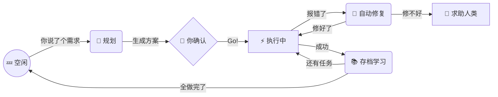

<div align="center">

# 🌌 Antigravity Agent OS

### 给你的 AI 编程助手装上"大脑"

<br/>

**让 AI 不再是金鱼记忆，而是一个越用越聪明的编程搭档。**

<br/>

[](docs/prd/codex-dispatcher-user.md)
[](docs/prd/evolution-engine.md)
[](#-30-秒快速上手)
[](#-适配任何项目)

</div>

---

## 🏁 一键安装

克隆仓库，运行初始化向导——脚本会交互式地帮你配好一切：

```bash
git clone https://github.com/flockmaster/agent-os.git
cd agent-os

# macOS / Linux
bash setup.sh /path/to/your-project

# Windows (PowerShell)
pwsh setup.ps1 -TargetDir "D:\your-project"
```

> 向导会询问你的**项目名称**、**技术栈**和**AI 工具**，然后自动完成：
> - 将 `.agent/` 复制到你的项目
> - 生成定制化的记忆文件
> - 写入 `.gitignore` 规则
> - 安装 AI 全局配置

<details>
<summary>📸 <b>安装向导长什么样？</b>（点击展开）</summary>
<br/>

```
╔══════════════════════════════════════════╗
║   🌌 Antigravity Agent OS — Setup        ║
║   给你的 AI 编程助手装上大脑              ║
╚══════════════════════════════════════════╝

🔧 Step 1/5 — 设置目标项目
   ✅ 目标目录: D:\my-awesome-app

🔧 Step 2/5 — 项目信息
   项目名称: My Awesome App
   选择技术栈:
     [1] Flutter / Dart
     [2] React / TypeScript
     [3] Vue / TypeScript
     ...
   ✅ 项目: My Awesome App | React / TypeScript / Component

🔧 Step 3/5 — 选择你的 AI 编程工具
     [1] Gemini
     [2] GitHub Copilot
     [3] Claude
   ✅ AI 工具: GitHub Copilot

🔧 Step 4/5 — 安装 Agent OS 到项目
   ✅ 已复制 .agent/
   ✅ 已初始化 project_decisions.md
   ✅ 已重置 active_context.md
   ✅ 已追加 .gitignore 规则

🔧 Step 5/5 — 安装 AI 全局配置
   ✅ 已安装全局配置

╔══════════════════════════════════════════╗
║   🎉 安装完成！                          ║
╚══════════════════════════════════════════╝
   👉 对 AI 说: /start
```

</details>

---

## 😤 痛不痛？

你有没有遇到过这些场景：

| 场景 | 痛感指数 |
|------|:------:|
| 新开一个聊天窗口，又要从头跟 AI 解释项目背景 | 🔥🔥🔥🔥🔥 |
| 让 AI 改完代码，它忘了 commit，你也忘了 | 🔥🔥🔥🔥 |
| 同样的 bug 上周修过一次，今天 AI 又走了一遍弯路 | 🔥🔥🔥🔥🔥 |
| 让 AI 写个功能，写一半停下来问"要继续吗？" | 🔥🔥🔥 |
| PRD 拆了 20 个子任务，在一个窗口做完上下文必爆 | 🔥🔥🔥🔥🔥 |
| AI 每次都像新来的实习生，你是永远的导师 | 🔥🔥🔥🔥🔥 |

> **根本原因：AI Agent 没有记忆，没有流程，没有成长机制。**

Antigravity 就是解决这个问题 —— **一个 `.agent/` 文件夹，给你的 AI 装上大脑。**

---

## 🧠 它能做什么？

<table>
<tr>
<td width="50%">

### 💾 记得住事
AI 终于有了"长短期记忆"，不再每次从零开始。

- 🟢 **项目背景**：架构、技术栈、关键决策，只说一次就够
- 🟢 **工作进度**：关掉窗口明天接着干，断点续传
- 🟢 **你的偏好**：代码风格、沟通习惯，越用越懂你

</td>
<td width="50%">

### 🧬 学得会
每完成一个任务，AI 会自动总结经验教训。

- 🟢 **知识积累**：踩过的坑自动记录，绝不踩第二次
- 🟢 **模式识别**：自动发现代码中的通用模板
- 🟢 **效能优化**：追踪工作效率，自动调优流程

</td>
</tr>
<tr>
<td width="50%">

### 🚀 干得完
不再"做一步问一步"，而是全自动交付。

- 🟢 **一句话需求** → 自动生成方案 + 写代码 + 测试 + 提交
- 🟢 **报错自愈**：遇到 bug 自动修 3 轮，修不好再找你
- 🟢 **续航模式**：一个功能做完自动接下一个

</td>
<td width="50%">

### 🔌 搬得走
不绑定任何框架，哪个项目都能用。

- 🟢 **即插即用**：拷贝一个文件夹到项目里就行
- 🟢 **技术无关**：Flutter、React、Python、Go... 全都行
- 🟢 **团队共享**：打包给同事，开箱即用

</td>
</tr>
</table>

---

## 🎯 杀手锏：任务调度器 (Dispatcher)

> **解决最核心的痛点：大型 PRD 在单个对话窗口中上下文爆炸。**

传统做法是在一个 AI 窗口里做完所有事——10 个子任务做到第 7 个时，AI 已经开始"幻觉"了。

Antigravity 的方案：**PM + Worker 分离架构**。

```
┌─────────────────────────────────────────────────┐
│                 你 (User)                        │
│         "帮我实现这个 PRD"                        │
└────────────────────┬────────────────────────────┘
                     │
                     ▼
┌─────────────────────────────────────────────────┐
│            Antigravity (PM)                      │
│                                                  │
│  📄 读取 PRD → 拆解 20 个子任务                   │
│  🧠 选择下一个 → 构造精准 Prompt                  │
│  📡 派发给 Worker → 监控执行                      │
│  🔧 Worker 有问题？PM 自主回答                    │
│  ✅ 完成 → Git 提交 → 自动派发下一个               │
└────────────┬────────────────────────────────────┘
             │ 每个任务独立派发
             ▼
┌─────────────────────────────────────────────────┐
│           Codex Worker (独立上下文)               │
│                                                  │
│  🆕 全新窗口 → 只知道当前任务                     │
│  ✍️ 写代码 → 测试 → 汇报结果                     │
│  🧹 执行完毕即销毁，零污染                        │
└─────────────────────────────────────────────────┘
```

**为什么这很重要？**

| 对比 | 传统单窗口 | PM + Worker |
|------|:---------:|:-----------:|
| 第 1 个任务 | 🟢 清醒 | 🟢 清醒 |
| 第 5 个任务 | 🟡 开始模糊 | 🟢 全新上下文 |
| 第 15 个任务 | 🔴 幻觉/遗忘 | 🟢 依然清醒 |
| 总体质量 | 递减 | 恒定 |

### 两种调度模式

**模式 A：Agent 原生调度**（推荐）

对 Antigravity 说"执行 PRD"，它会读取 `codex-dispatch.md` 工作流，用自然语言理解 PRD 结构并逐个派发：

```
你：执行 docs/prd/feature-x-dev.md
AI：找到 10 个任务，T-001 已完成。
    ▶ 启动 T-002... ✅ 完成，已提交 Git
    ▶ 启动 T-003... Worker 提问："日志放哪？" → PM 自动回答 → ✅ 完成
    ▶ 启动 T-004... ❌ 失败(3次) → 标记 BLOCKED，跳到 T-005
    ...
    🎉 8/10 任务完成，2 个 BLOCKED 待处理。
```

**模式 B：程序化调度**（大型项目 / CI 集成）

```bash
# 直接用命令行跑，适合 20+ 任务的大型 PRD
python -m dispatcher.main --prd docs/prd/feature-x-dev.md

# 先预览不执行
python -m dispatcher.main --prd docs/prd/feature-x-dev.md --dry-run
```

---

## ⚡ 30 秒快速上手

**方式一：运行安装向导（推荐）**

```bash
# 向导会交互式引导你完成所有配置
bash setup.sh /path/to/your-project       # macOS / Linux
pwsh setup.ps1 -TargetDir "D:\project"     # Windows
```

**方式二：手动安装**

```bash
# 1️⃣ 把 .agent/ 文件夹拷贝到你的项目根目录
cp -r .agent/ /path/to/your-project/

# 2️⃣ 编辑 .agent/memory/project_decisions.md，填入你的技术栈

# 3️⃣ 在 IDE 中打开项目，对 AI 说：
```

> **你说**：`/start`
> **AI 回**："系统就绪，记忆已加载。请吩咐。"

---

## 🎬 日常使用长什么样？

### 场景一：开发新功能

```
你：我想加一个微信登录功能
AI：好的，我已生成设计方案，请确认 ✅ → [查看方案]
你：Go!
AI：✅ 代码已写完 → ✅ 编译通过 → ✅ 测试通过 → ✅ 已提交 Git
    开始处理下一个任务...
```

### 场景二：隔天继续

```
你：早
AI：早！昨天做到"用户登录"模块的第 3 个子任务，还剩 2 个。继续？
你：继续
AI：🔨 Working...
```

### 场景三：遇到 Bug

```
你：（粘贴一大堆红色报错）
AI：检测到 NullPointerException...
    → 第 1 次修复尝试 ❌
    → 第 2 次修复尝试 ✅ 已解决！原因已记入知识库。
```

---

## 🗂️ 系统结构一览

```
.agent/                          ← 整个"大脑"就在这个文件夹里
│
├── 📂 memory/                   ← 记忆中枢
│   ├── active_context.md            今天在干嘛？（短期记忆）
│   ├── project_decisions.md         项目的"宪法"（长期记忆）
│   ├── user_preferences.md          你喜欢什么风格？
│   ├── 📂 evolution/               进化引擎数据
│   └── 📂 knowledge/               AI 积累的知识库
│
├── 📂 dispatcher/               ← 🎯 任务调度器 (PM→Worker)
│   ├── core.py                      数据结构 (TaskSpec/WorkerResult)
│   ├── worker.py                    Codex CLI 封装器
│   ├── restart_injector.py          重启注入机制 (问答传递)
│   ├── decision_engine.py           PM 自主决策引擎
│   ├── git_ops.py                   Git 自动提交
│   ├── prd_updater.py               PRD 状态回写
│   ├── main.py                      CLI 入口
│   └── 📂 tests/                   85 个单元测试
│
├── 📂 adapters/                 ← 多模型适配器
│   ├── gemini/                      Gemini 全局配置模板
│   ├── copilot/                     Copilot 全局配置模板
│   └── claude/                      Claude 全局配置模板
│
├── 📂 rules/                    ← 行为规则
│   └── router.rule                  任务分发路由
│
├── 📂 skills/                   ← 技能模块
│   ├── evolution-engine/            自进化引擎
│   ├── context-manager/             记忆管理器
│   └── prd-crafter/                 需求文档生成器
│
└── 📂 workflows/                ← 自动化流程
    ├── codex-dispatch.md            🎯 调度器工作流 (Agent 原生)
    ├── feature-flow.md              功能开发全流程
    ├── evolve.md                    学习与进化
    └── reflect.md                   复盘与反思
```

---

## 🔌 适配任何项目

Antigravity 与技术栈无关。只需修改一行配置：

```markdown
# .agent/memory/project_decisions.md

Tech Stack: Flutter / Dart / MVVM    ← 改成你的技术栈就行
```

| 已验证 | 理论兼容 |
|:------|:--------|
| Flutter / Dart | React / TypeScript |
| Python / Django | Vue / Nuxt |
| Node.js / Express | Go / Gin |

---

## ⌨️ 命令速查表

| 命令 | 干什么用 | 一句话说明 |
|:---:|---------|-----------|
| `/start` | ⚡ 开机 | 加载记忆，恢复上下文 |
| `/suspend` | 💾 存档 | 保存进度，下次接着干 |
| `/feature-flow` | 🚀 造功能 | 需求→方案→编码→测试→提交，一条龙 |
| `/analyze-error` | 🔥 灭火 | 智能分析报错，自动修复 |
| `/evolve` | 🧬 进化 | 整理知识库，让 AI 变聪明 |
| `/reflect` | 💭 复盘 | 总结经验教训 |
| `/status` | 📊 看板 | 当前任务做到哪了 |
| `/rollback` | ⏪ 后悔药 | 回到上一个安全版本 |
| `/meta` | 🔧 改系统 | 修改 AI 自身的行为规则 |
| `/dispatch` | 🎯 调度 | PM 模式：拆任务→派 Worker→逐个完成 |
| `/export` | 📦 打包 | 导出干净的系统副本给别人 |

---

## 🔄 它是怎么运转的？



> **关键设计**：AI 遇到错误不会立刻停下，而是自动重试最多 3 次。只有真的搞不定才会打扰你。

---

## 📝 版本演进

| 版本 | 里程碑 |
|:---:|-------|
| **v4.0** 🆕 | **Task Dispatcher**: PM→Worker 分离架构，上下文隔离，大型 PRD 无损执行 |
| **v3.0** | 自进化引擎：知识收割 + 模式库 + 自动反思 |
| **v2.1** | 状态机 + Git 检查点保护 + 自动修复循环 |
| **v2.0** | 结构化记忆系统 + PRD 全流程自动化 |
| **v1.0** | 基础规则引擎 + 对话驱动 |

---

## 🤔 常见问题

<details>
<summary><b>Q：这跟直接写 Prompt 有啥区别？</b></summary>
<br/>
Prompt 是"一次性的叮嘱"，关掉窗口就没了。Antigravity 是"持久化的操作系统"——记忆、规则、知识库都存在文件里，AI 每次启动都自动加载。就像给 AI 从"每天新入职"变成"老员工"。
</details>

<details>
<summary><b>Q：会不会搞乱我的项目代码？</b></summary>
<br/>
不会。系统所有文件都在 <code>.agent/</code> 文件夹里，与你的业务代码完全隔离。加一行 <code>.gitignore</code> 就能控制哪些文件纳入版本管理。
</details>

<details>
<summary><b>Q：支持哪些 AI 工具？</b></summary>
<br/>
理论上支持所有能读取项目文件的 AI 编程助手（Cursor、Copilot、Gemini Code Assist 等）。核心原理是通过文件系统传递上下文，不依赖任何特定 API。<br/><br/>
<b>Dispatcher 调度功能</b>目前需要搭配 <a href="https://github.com/openai/codex">Codex CLI</a> 使用（作为 Worker 执行器）。PM 角色可由 Antigravity (Gemini)、Copilot 或 Claude 担任。
</details>

<details>
<summary><b>Q：Dispatcher 和直接让 AI 写代码有什么区别？</b></summary>
<br/>
直接让 AI 在一个窗口做 20 个任务，到后面它会“忘记”前面做过的事，产生幻觉。Dispatcher 让每个子任务在<b>独立的上下文</b>中执行——就像给每个任务安排一个“新员工”，但有一个“项目经理”在上面统筹协调。PM 的上下文只保留摘要，不会爆炸。
</details>

<details>
<summary><b>Q：记忆库会不会越来越大？</b></summary>
<br/>
不会。系统内置了"遗忘机制"——过期决策自动标记 Deprecated 并清理，完成的任务归档压缩，知识库定期整理去重。
</details>

---

<div align="center">

**⭐ 如果觉得有用，给个 Star 是最大的鼓励**

Made with 🧠 by **Antigravity Systems**

*让每一次对话，都不白聊。*

</div>
