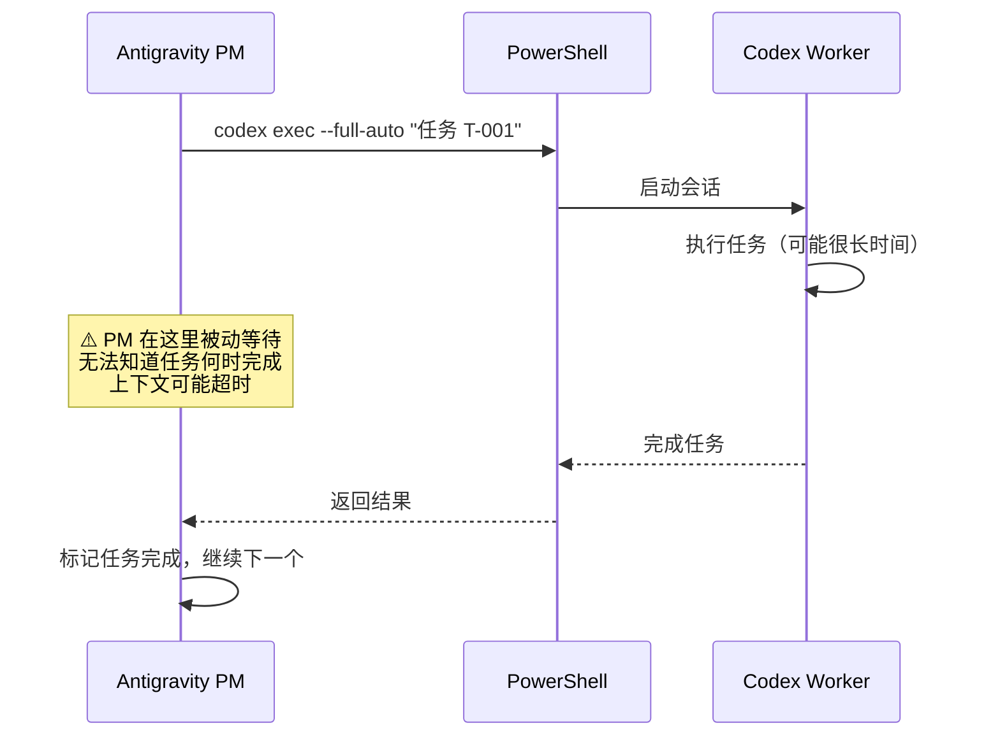
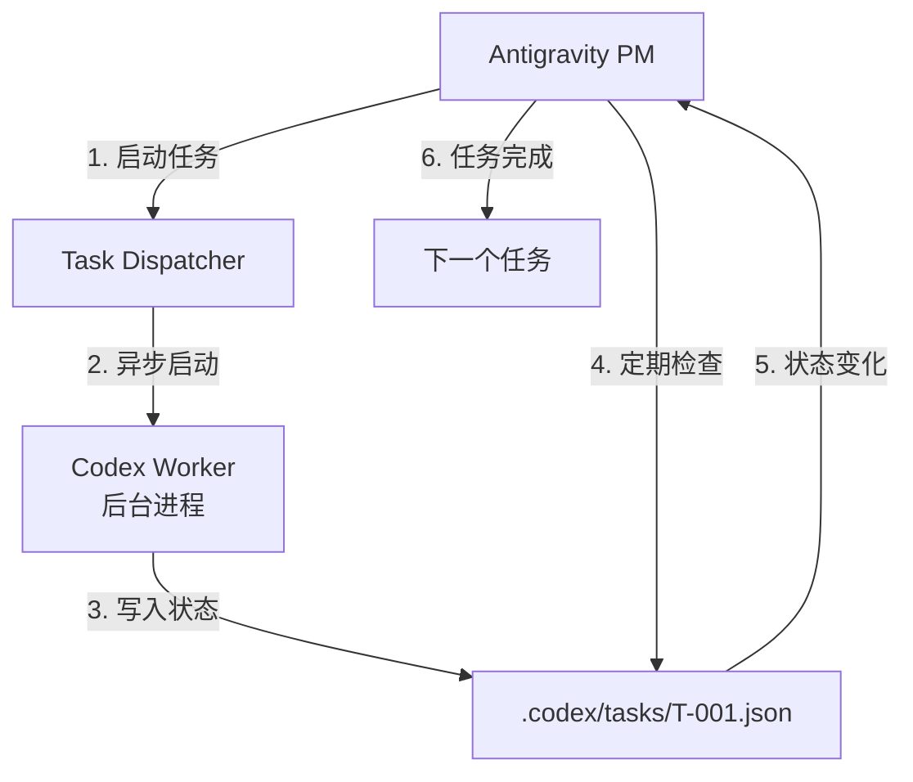
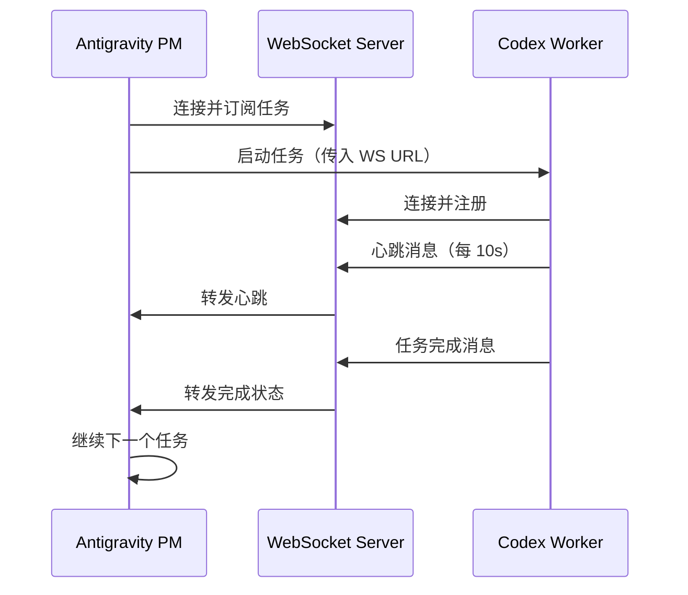
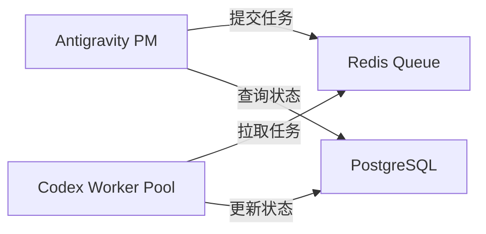

# Codex 子任务监控与心跳机制设计方案

> **问题背景**：当前 Codex Dispatcher 使用 `--full-auto` 模式派发任务，但对于复杂任务（如网页开发），  
> 模型是被动等待的，无法主动监控子任务执行完成，导致调度流程无法自动继续。

---

## 🎯 核心问题分析

### 当前流程的痛点



**问题**：
1. **被动等待**：PM (Antigravity) 必须等待 `codex exec` 命令返回
2. **无法监控**：不知道 Worker 当前进度
3. **超时风险**：复杂任务会导致 PM 会话超时或上下文过载
4. **无法并行**：一次只能执行一个任务

---

## 💡 解决方案：心跳监控机制

### 方案 A：异步执行 + 状态轮询（推荐）

#### 架构设计



#### 实现步骤

##### 1. 修改任务启动方式

**原来的方式**（阻塞）：
```powershell
codex exec --full-auto "执行任务 T-001"
```

**新方式**（异步 + 守护进程）：
```powershell
# 启动后台任务，返回 Session ID
$sessionId = codex exec --daemon --full-auto "执行任务 T-001" | Out-String
$sessionId = $sessionId.Trim()

# 将 Session ID 写入任务状态文件
$taskState = @{
    taskId = "T-001"
    sessionId = $sessionId
    status = "RUNNING"
    startTime = (Get-Date).ToString("o")
    lastHeartbeat = (Get-Date).ToString("o")
} | ConvertTo-Json

New-Item -Path ".codex/tasks" -ItemType Directory -Force
$taskState | Out-File ".codex/tasks/T-001.json"
```

##### 2. 添加 Worker 心跳检测

Worker 执行期间，每隔一定时间更新状态文件：

```javascript
// Codex Worker 内部逻辑（需要在 Worker 端实现）
setInterval(() => {
    const taskState = {
        taskId: process.env.TASK_ID,
        sessionId: process.env.SESSION_ID,
        status: "RUNNING",
        progress: "正在编写组件...",  // 当前进度描述
        lastHeartbeat: new Date().toISOString()
    };
    
    fs.writeFileSync(`.codex/tasks/${process.env.TASK_ID}.json`, 
                     JSON.stringify(taskState, null, 2));
}, 10000); // 每 10 秒更新一次
```

##### 3. PM 轮询检测

Antigravity PM 定期检查任务状态：

```powershell
function Wait-TaskCompletion {
    param(
        [string]$TaskId,
        [int]$TimeoutSeconds = 3600,  # 默认 1 小时超时
        [int]$CheckIntervalSeconds = 15  # 每 15 秒检查一次
    )
    
    $startTime = Get-Date
    $stateFilePath = ".codex/tasks/$TaskId.json"
    
    while ($true) {
        # 检查超时
        $elapsed = (Get-Date) - $startTime
        if ($elapsed.TotalSeconds -gt $TimeoutSeconds) {
            Write-Warning "任务 $TaskId 超时（${TimeoutSeconds}s）"
            return "TIMEOUT"
        }
        
        # 读取状态文件
        if (Test-Path $stateFilePath) {
            $state = Get-Content $stateFilePath | ConvertFrom-Json
            
            # 检查心跳时间
            $lastHeartbeat = [DateTime]::Parse($state.lastHeartbeat)
            $heartbeatAge = (Get-Date) - $lastHeartbeat
            
            if ($heartbeatAge.TotalSeconds -gt 60) {
                Write-Warning "任务 $TaskId 心跳超时（60s 未更新）"
                return "HEARTBEAT_TIMEOUT"
            }
            
            # 检查任务状态
            if ($state.status -eq "DONE") {
                Write-Host "✅ 任务 $TaskId 完成"
                return "DONE"
            } elseif ($state.status -eq "ERROR") {
                Write-Error "❌ 任务 $TaskId 失败: $($state.error)"
                return "ERROR"
            } elseif ($state.status -eq "RUNNING") {
                Write-Host "⚙️  任务 $TaskId 运行中: $($state.progress)"
            }
        }
        
        # 等待下次检查
        Start-Sleep -Seconds $CheckIntervalSeconds
    }
}

# 使用示例
$result = Wait-TaskCompletion -TaskId "T-001"

if ($result -eq "DONE") {
    # 继续下一个任务
    # ...
}
```

##### 4. Worker 完成时更新状态

Worker 任务完成后，主动更新状态为 `DONE`：

```javascript
// 任务完成
const taskState = {
    taskId: process.env.TASK_ID,
    sessionId: process.env.SESSION_ID,
    status: "DONE",
    completedTime: new Date().toISOString(),
    result: {
        filesChanged: ["index.html", "style.css", "script.js"],
        testsRun: 15,
        testsPassed: 15
    }
};

fs.writeFileSync(`.codex/tasks/${process.env.TASK_ID}.json`, 
                 JSON.stringify(taskState, null, 2));
```

---

### 方案 B：WebSocket 实时通信（高级方案）

如果需要更实时的监控，可以在 Codex Worker 和 PM 之间建立 WebSocket 连接。

#### 架构



#### 实现要点

1. **启动 WebSocket 服务器**：可以用 Node.js、Python 或 PowerShell Core
2. **Worker 连接**：启动时传入 WebSocket URL
3. **消息协议**：
   - `heartbeat`: 心跳消息
   - `progress`: 进度更新
   - `complete`: 任务完成
   - `error`: 任务失败

---

### 方案 C：任务队列 + 数据库（企业级方案）

使用 Redis、PostgreSQL 等存储任务状态：



优点：
- 支持多 Worker 并行
- 任务持久化
- 支持任务优先级、重试等高级功能

缺点：
- 需要额外的基础设施
- 复杂度较高

---

## 🏆 推荐方案总结

### 短期方案（立即可用）：方案 A - 状态文件轮询

**优点**：
- ✅ 无需额外依赖
- ✅ 实现简单
- ✅ 跨平台兼容
- ✅ 易于调试

**缺点**：
- ❌ 轮询有延迟（可接受：15 秒）
- ❌ 不支持并行任务（可通过多状态文件扩展）

### 中期方案：方案 B - WebSocket 实时通信

**适用场景**：
- 需要实时进度展示
- 需要双向通信（PM 可以中断任务）
- 多任务并行执行

### 长期方案：方案 C - 任务队列系统

**适用场景**：
- 多用户、多项目
- 需要任务优先级
- 需要负载均衡
- 企业级部署

---

## 🛠️ 实现清单

### Phase 1: 状态文件机制（1-2 天）
- [ ] 创建 `.codex/tasks/` 目录结构
- [ ] 实现任务状态 JSON Schema
- [ ] 修改 `codex exec` 支持 `--daemon` 模式
- [ ] 在 Worker 中添加状态文件写入逻辑
- [ ] 实现 `Wait-TaskCompletion` PowerShell 函数
- [ ] 更新 Dispatcher 工作流文档

### Phase 2: 心跳监控（1 天）
- [ ] Worker 添加定时心跳逻辑
- [ ] PM 添加心跳超时检测
- [ ] 添加任务重试机制

### Phase 3: 测试验证（1 天）
- [ ] 测试简单任务
- [ ] 测试复杂任务（网页开发）
- [ ] 测试超时场景
- [ ] 测试心跳失败场景
- [ ] 压力测试

---

## 📊 状态文件 Schema

```json
{
  "$schema": "http://json-schema.org/draft-07/schema#",
  "type": "object",
  "required": ["taskId", "sessionId", "status"],
  "properties": {
    "taskId": {
      "type": "string",
      "description": "任务 ID（如 T-001）"
    },
    "sessionId": {
      "type": "string",
      "description": "Codex Worker 会话 ID"
    },
    "status": {
      "type": "string",
      "enum": ["PENDING", "RUNNING", "DONE", "ERROR", "TIMEOUT"],
      "description": "任务状态"
    },
    "startTime": {
      "type": "string",
      "format": "date-time",
      "description": "任务开始时间（ISO 8601）"
    },
    "lastHeartbeat": {
      "type": "string",
      "format": "date-time",
      "description": "最后心跳时间"
    },
    "completedTime": {
      "type": "string",
      "format": "date-time",
      "description": "任务完成时间"
    },
    "progress": {
      "type": "string",
      "description": "当前进度描述"
    },
    "result": {
      "type": "object",
      "description": "任务执行结果",
      "properties": {
        "filesChanged": {
          "type": "array",
          "items": { "type": "string" }
        },
        "testsRun": { "type": "integer" },
        "testsPassed": { "type": "integer" }
      }
    },
    "error": {
      "type": "string",
      "description": "错误信息"
    }
  }
}
```

---

## 🔄 完整工作流示例

```powershell
# 1. PM 启动任务
function Start-CodexTask {
    param([string]$TaskId, [string]$Prompt)
    
    # 启动守护进程
    $sessionId = codex exec --daemon --full-auto $Prompt | Out-String
    $sessionId = $sessionId.Trim()
    
    # 写入初始状态
    $state = @{
        taskId = $TaskId
        sessionId = $sessionId
        status = "RUNNING"
        startTime = (Get-Date).ToString("o")
        lastHeartbeat = (Get-Date).ToString("o")
    } | ConvertTo-Json
    
    New-Item -Path ".codex/tasks" -ItemType Directory -Force
    $state | Out-File ".codex/tasks/$TaskId.json"
    
    return $sessionId
}

# 2. 等待任务完成
function Wait-CodexTask {
    param([string]$TaskId)
    
    while ($true) {
        $state = Get-Content ".codex/tasks/$TaskId.json" | ConvertFrom-Json
        
        if ($state.status -eq "DONE") {
            return $state.result
        } elseif ($state.status -eq "ERROR") {
            throw "任务失败: $($state.error)"
        }
        
        Write-Host "⚙️  $($state.progress)"
        Start-Sleep -Seconds 15
    }
}

# 3. 使用示例
$sessionId = Start-CodexTask -TaskId "T-001" -Prompt "创建网页"
Write-Host "✅ 任务 T-001 已启动，Session ID: $sessionId"

$result = Wait-CodexTask -TaskId "T-001"
Write-Host "✅ 任务完成，修改文件: $($result.filesChanged -join ', ')"
```

---

## 📌 下一步行动

1. **验证可行性**：测试 `codex exec --daemon` 是否支持后台运行
2. **实现 MVP**：先实现状态文件机制的最小可用版本
3. **集成到 Dispatcher**：更新 `codex-dispatch.md` 工作流
4. **文档更新**：补充心跳监控的使用说明

---

## 🎯 结论

**方案 A（状态文件 + 轮询）** 是当前最适合的方案：
- 无需修改 Codex 核心代码（如果不支持 `--daemon`，可以用 PowerShell 后台作业）
- 实现简单，调试容易
- 满足当前需求（单用户、单项目）

后续可以根据需要逐步演进到 WebSocket 或队列方案。
